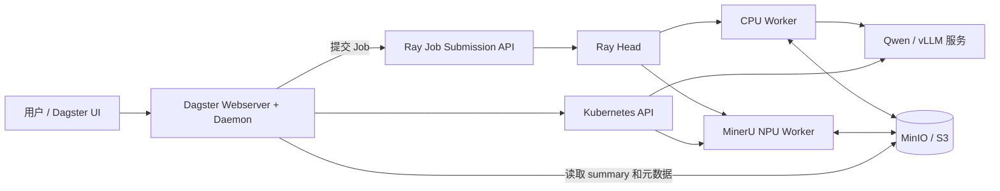
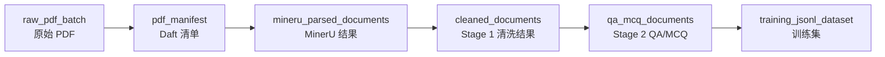
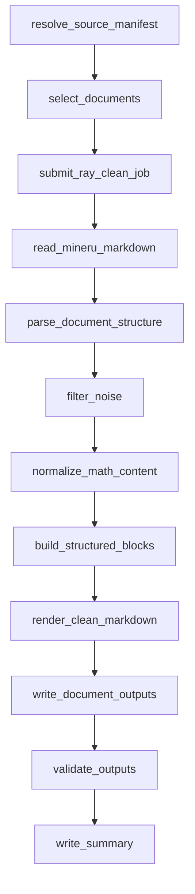

# Dagster 与 K12 数据生产管线：20 分钟演示讲稿

> 适用场景：面向项目组介绍 Dagster、Daft、Ray、KubeRay、MinerU、Qwen、MinIO 等组件，并以 `cleanjopbstage1_10` 为例讲解实际代码和运行逻辑。  
> 建议时长：18～22 分钟。  
> 使用方式：正文可直接照读；标有“演示提示”的内容是现场操作，不需要念出。  
> 数据口径：运行数据和部署信息来自所给材料中 2026-09-14 至 2026-09-15 的审计与演示记录，现场应以实际 UI 状态为准。

---

## 一、开场：今天要讲清楚什么（0:00～1:00）

大家好，今天我用大约 20 分钟介绍一下我们这套 K12 教材数据生产管线。

我会按两个层次来讲。第一部分先讲整体框架：Dagster、Daft、Ray、Kubernetes、MinerU、Qwen 和 MinIO 各自负责什么，它们之间是怎样配合的。第二部分再进入代码和一次真实任务，看看 `cleanjopbstage1_10` 从点击 Launch 到最终写出清洗结果，中间具体发生了什么。

大家可以先记住一句话：

> Dagster 负责“编排和治理”，Ray 负责“并行调度”，Worker 负责“真正计算”，MinIO 负责“数据交换和结果保存”。

后面所有概念都可以放回这四个角色中理解。

---

## 二、先看整体框架：控制平面与数据平面（1:00～4:00）

先看整套系统的全景。



这里可以分成两个平面。

第一个是控制平面，包括 Dagster、Ray Head 和 Kubernetes。它们负责接收参数、启动任务、调度资源、跟踪状态，但尽量不搬运整本教材的数据。

第二个是数据平面，也就是 CPU 或 NPU Worker 直接从 MinIO 读取输入，完成计算，再把产物写回 MinIO。这样，大文件不会在 Dagster Web 服务和 Ray Head 之间来回传输。

Dagster 本身又分成两个主要进程。Webserver 提供 UI、Launchpad、GraphQL，以及 Job 和 Asset 的浏览；Daemon 负责排队、启动 Run、执行 Sensor 和后台协调。当前这两个进程运行在同一个 Kubernetes Deployment 中，并加载同一个 Python Definitions 模块：

```text
clean_qa.mineru_dagster.definitions
```

所以我们在 UI 里看到的 Job、Asset、Asset Check 和 Sensor，本质上都是这个模块汇总后暴露出来的定义。

这里还要强调：Dagster 不是数据仓库。Run ID、事件、日志和物化记录在 Dagster Instance Storage 中；PDF、Markdown、JSONL 和模型产物主要保存在 MinIO；真正的并行执行状态由 Ray 管理；Worker 的资源和生命周期由 Kubernetes 或 KubeRay 管理。

---

## 三、几个组件分别做什么（4:00～7:00）

### 1. Dagster：统一入口和审计系统

Dagster 回答的是：任务是什么、以什么配置运行、现在到哪一步、最后是否通过质量门、产出了哪个数据资产。

它负责注册 Job、Asset、Asset Check、Sensor 和 Resource；接收 Launchpad 参数；生成 Run ID；提交外部计算；记录日志和元数据；最后把一次运行与长期的数据血缘联系起来。

但是 Dagster 不负责逐行清洗教材，也不会在 Webserver 里直接加载大模型。

### 2. Daft：面向数据集的扫描和 manifest 构建

Daft 可以理解成一个分布式 DataFrame 计算框架。在这套链路里，它主要用于扫描 S3 或 MinIO 中的大量 PDF 对象，读取 bucket、key、etag、size 等信息，然后形成稳定的 manifest。

也就是说，Daft 解决的是“数据集中有哪些输入”。它把大量对象整理成小型任务描述，供后续 MinerU 或 Ray 使用。今天演示的 Stage 1 已经有固定的 10 本 selection manifest，所以本次运行不会重新用 Daft 扫描全部 PDF；Daft 位于更上游。

### 3. Ray：真正的分布式计算调度层

Ray 接到 Dagster 提交的 entrypoint 后，由 Ray Head 建立运行环境、维护任务队列，并把每本文档分发到 CPU Worker。Stage 1 中一本文档对应一个 Ray Task，每个 Task 占用一个 CPU；最大在途数是 8，所以最多同时处理 8 本。

Ray 和 Dagster 的区别是：Dagster 管跨系统的业务流程和可观测性，Ray 管计算资源、Task、Actor、并发和重试。

### 4. KubeRay 与 Kubernetes：资源底座

KubeRay 把 Ray Head 和 Worker Group 声明为 Kubernetes 资源。CPU Worker 承担清洗、S3 I/O 和 Stage 2 的协调；MinerU 和 Qwen Worker 使用 NPU，可以按需扩缩。Kubernetes 还负责 Service、Secret、ServiceAccount 和 RBAC。

### 5. MinerU 与 Qwen

MinerU 负责把 PDF 解析为 Markdown 和结构化 JSON，包括文字、公式、表格、图片等信息。它属于上游文档解析阶段。

Qwen 通过 vLLM-Ascend 以常驻 HTTP 服务的方式提供推理，主要用于 Stage 2 的 QA/MCQ 生成和 Judge。Ray Worker 发 HTTP 请求调用它，Dagster 的 op 不直接加载模型。

### 6. MinIO：阶段之间的数据合同

MinIO 不只是“放文件的地方”。manifest 决定输入集合，`_PROGRESS.json` 表示进度，单文档 `_SUCCESS.json` 表示事务完成，批次 `_SUMMARY.json` 表示最终结果。它们共同构成阶段之间可校验、可恢复的数据合同。

---

## 四、Dagster 中最容易混淆的几个概念（7:00～10:30）

接下来区分四组概念：Job Graph、Asset Lineage、Code Location 和 Deployment。

### 1. Job 与 Run

Job 是一套可执行流程定义，例如 `cleanjopbstage1_10`；Run 是 Job 的某一次具体执行，有唯一 Run ID、配置、状态和日志。

Job Graph 展示一次运行中 op 的控制依赖。例如：先解析输入，再提交 Ray，最后校验输出。它回答的是“这次计算按什么顺序执行”。

### 2. Asset 与 Global Asset Lineage

Asset 是长期存在的数据产品，不是一个 Python 函数。本系统的主数据链路是：



Global Asset Lineage 回答“数据从哪里来、下游依赖谁”。它不是某一次 Run 的时间线。

同一个 Asset 还能按 `batch_id` 做动态分区。Partition 表示这份数据属于哪个批次；Materialization 表示某个批次在某个时间真正生成过；Asset Check 则判断已经发布的数据是否符合合同，例如数量是否匹配、失败数是否为零、必要文件和成功标记是否齐全。

这里有一个重要边界：`cleanjopbstage1_10` 当前是普通 op-based Job。它运行成功，说明计算确实成功；MinIO 的 `_SUMMARY.json` 和 `_SUCCESS.json` 也是真实的数据完成证据。但是静态 AssetSpec 只定义血缘，Run 本身目前没有自动登记 `cleaned_documents` 的 materialization。演示时不能把“图上定义了这条边”直接说成“本次 Run 已经自动更新了 Asset 页”。

### 3. Code Location 与 Definitions

Definitions 是 Python 侧的聚合对象，把 Assets、Checks、Jobs、Sensors 和 Resources 装在一起。Code Location 是 Dagster 加载这组 Definitions 的运行边界。

当前的加载链路可以简化成：

```text
jobs/*.py、assets/*.py
        ↓
jobs/__init__.py 中的 ALL_JOBS
        ↓
clean_qa/mineru_dagster/definitions.py
        ↓
Code Location: clean_qa.mineru_dagster.definitions
        ↓
Repository: __repository__
        ↓
Dagster UI
```

多个完全不同的 Job 可以同时出现在一个 Code Location 中。当前材料里共有 19 个显式 Job，可以按职责分为 MinerU 编排、Stage 1 清洗、Stage 2 QA/MCQ、Qwen 生命周期、端到端演示，以及 Asset Demo。它们并不是每个 Job 对应一个独立 Deployment。

### 4. Deployment

Deployment 是 Kubernetes 中实际运行 Dagster Webserver 和 Daemon 的地方。它决定代码镜像、环境变量、ServiceAccount 和网络入口。Code Location 决定“Dagster 看见哪些定义”，Deployment 决定“这些定义在哪里被加载和控制”。真正的大规模计算仍然会被转交给 Ray 或 NPU Worker。

> 演示提示：此处先打开 Global Asset Lineage，再切到 Jobs 页面，让听众直观看到“资产图”和“任务图”是两张不同的图。

---

## 五、进入代码：一个 Job 怎样从源码出现在 UI 中（10:30～12:00）

现在进入代码逻辑。

第一层是 `definitions.py`。它相当于整个 Code Location 的总装配入口，汇总 Assets、Asset Checks、Jobs、Sensors 和 Resources。线上 `K12_PIPELINE_PROFILE=full`，所以 CPU 和 NPU 相关 Job 都会进入同一个 Repository。

第二层是 `stage1_jobs.py`。这里定义 `cleanjopbstage1_10` 的 Dagster Job Graph，以及每个 op 接收的配置和上下游依赖。

第三层是 `stage1_clean/driver.py`。Dagster 不直接执行每本文档的清洗，而是把配置编译成类似下面的 Ray entrypoint：

```bash
python3 -m k12_clean_qa_pipeline.stage1_clean.driver \
  --source-bucket k12-mineru-output \
  --source-prefix <mineru-success-prefix> \
  --output-bucket k12-cleaned-corpus \
  --output-prefix <new-stage1-prefix> \
  --selection-manifest-key cpu-smoke/manifests/stage1_test_10.json \
  --limit 10 \
  --max-document-inflight 8 \
  --resume
```

第四层是 `stage1_clean/core.py`，这里才是确定性清洗的核心，包括分块、章节路径、内容分类、噪声过滤、公式规范化、图片和表格处理，以及稳定 `block_id` 的生成。

最后还有 `validation.py`、`atomic_writer.py` 和 `progress.py`，分别负责质量校验、原子发布和进度记录。

---

## 六、主案例：`cleanjopbstage1_10` 到底怎样运行（12:00～17:30）

这次演示的 Job 不会重新调用 MinerU。它读取一批已经由 MinerU 成功解析的教材，从固定 manifest 中选择 10 本，通过 Ray 的 CPU Worker 完成 Stage 1 清洗。

### 1. 启动前：输入合同

每本文档必须至少存在 Markdown、`content_list.json`、`middle.json` 和 MinerU `_SUCCESS.json`。同时，上游批次的 `_SUMMARY.json` 必须是 `status=success` 且失败数为零。

这是 fail-closed 设计：上游不完整时，下游直接停止，而不是悄悄处理一个残缺集合。

这 10 本也不是临时取对象列表中的前 10 本，而是由固定的 selection manifest 指定。这样每次演示输入相同，结果可比较，也不受 S3 对象新增和排序变化影响。

### 2. Dagster Job Graph



这里要分清真实控制节点和可视化探针。

`resolve_source_manifest` 会验证版本、上游 summary、selection manifest，以及输入输出前缀不能互相覆盖。`select_documents` 确认文档集合。`submit_ray_clean_job` 生成 Ray Job ID，并通过 Job Submission API 提交真正的计算。`validate_outputs` 等待 Ray 进入终态，然后读取 MinIO 的 `_SUMMARY.json`，决定整个 Dagster Run 成功还是失败。`write_summary` 最后把 Dagster Run ID、Ray Job ID 和 S3 输出 URI 汇总起来。

而中间从 `read_mineru_markdown` 到 `write_document_outputs` 的多个绿色节点，目前主要是为了在 Dagster UI 中展示业务语义。它们传递同一个 state 并记录 metadata；真正的读取、过滤、规范化和写入都发生在 Ray Driver 内部。因此这些节点变绿，不代表 Dagster 分别执行了七个独立的分布式计算阶段，也不能用它们的耗时作为真实的阶段耗时。

对这个 Job 来说，最关键的节点是 `validate_outputs`。只有 Ray 成功，并且 MinIO summary 满足质量条件，它才会变绿。

> 演示提示：打开 `cleanjopbstage1_10` 的 Run Graph，沿着上述节点从左到右讲；重点点开 `submit_ray_clean_job` 和 `validate_outputs` 的 metadata。

### 3. Ray Driver 内部

Ray Driver 先解析 selection manifest，为每本文档找到唯一的 Markdown、content list、middle JSON 和 MinerU 成功标记，然后写出稳定哈希的 `_RUN_MANIFEST.json`。这份文件回答“本次计划处理哪些输入”。

接着 Driver 使用有界并发：先提交最多 8 本，通过 `ray.wait` 等待任意一本完成；每释放一个位置，就补入下一本。这样不会一次创建几千个 ObjectRef 和 S3 连接。

单本文档对应一个 `process_document_remote`。它先读取 Markdown 并计算 `source_sha256`。如果开启 `resume`，并且已有 `_SUCCESS.json` 与当前版本、源哈希和七个必要产物都匹配，就安全跳过；否则进入 `build_stage1()` 重新处理。

### 4. `build_stage1()` 的清洗逻辑

核心代码会按标题和空行恢复文档块，维护 `chapter_path`，把内容分类为 concept、definition、formula、exercise、table 等类型；过滤版权页、定价、目录和自评等噪声；解析 MinerU 的图片描述；将 HTML 表格转为 Markdown；只在数学环境内修复数字和小数空格；不确定内容不直接删除，而是进入 quarantine。

最后，它用稳定输入生成稳定的 `block_id`，先形成规范主数据 `blocks.jsonl`，再由 blocks 投影出 `clean.md`。

这里特别强调：`blocks.jsonl` 才是 Stage 1 的主数据，`clean.md` 是面向人阅读或文本训练的投影。Stage 2 读取 blocks，因为里面保留了章节、块类型、来源、公式、图片、质量标记和证据 ID；如果重新从 Markdown 切块，这些结构和追溯关系都会丢失。

### 5. 原子发布与恢复

每本书会生成：

```text
clean.md
book_metadata.json
blocks.jsonl
exercises.jsonl
image_manifest.jsonl
quarantine.jsonl
cleaning_report.json
_SUCCESS.json
```

系统先计算各产物 SHA256，写入临时对象，再复制为正式 key；所有必要产物完成后，最后才写 `_SUCCESS.json`。所以 `_SUCCESS.json` 相当于单本文档的小型事务提交标志。

Resume 也不是只判断文件是否存在，而是同时验证成功标记、Stage 1 版本、源内容哈希和七个必要产物。任何一项不匹配，这本书都会重跑。

批次级还会生成 `_RUN_MANIFEST.json`、`_PROGRESS.json`、`_SUMMARY.json` 和 `_FAILED.jsonl`，分别用于输入审计、进度观察、最终判断和失败重试。

> 演示提示：若能查看 MinIO，先打开一本书的 `blocks.jsonl`，再打开 `clean.md`、`quarantine.jsonl` 和 `_SUCCESS.json`；最后回到批次目录展示 `_SUMMARY.json`。

---

## 七、怎样解读这次真实结果（17:30～19:00）

材料中的这次成功运行，Dagster Run ID 是：

```text
34ab2361-4a73-4d97-9d28-fe5af5415288
```

结果是 10 本全部成功，失败数为 0。Ray 的实际文档处理时间约 4.115 秒，Dagster 整体墙钟约 45.2 秒。这个差异不是性能异常：Dagster 的时间还包含 op 子进程启动、资源初始化、IO Manager 状态传递、Ray runtime env 准备、Job Submission 轮询和最终 summary 校验。对于 10 本的 smoke，固定编排开销占比会比较高；全量任务中，实际计算占比会明显上升。

本次聚合结果包括：

```text
保留内容块：23,228
删除内容块：259
隔离内容块：1,352
公式修复：2,595
教材习题：9,232
图片记录：9,497
```

输出总共 84 个对象：10 本乘以每本 8 个文档级对象，再加 4 个批次级控制对象。

排障时不要只记录一个 ID。建议始终同时保存三项：Dagster Run ID、Ray Job ID 和 S3 output prefix。Dagster Run 告诉我们“谁以什么配置启动”，Ray Job 告诉我们“计算在哪里执行”，S3 prefix 告诉我们“数据和完成证据在哪里”。三者合起来才是一条完整的可追溯链路。

还有一个演示边界：材料记录表明，开启 `automated_validation=true` 后，恢复演练会尝试删除一本书的正式 `_SUCCESS.json`，当前 MinIO 策略对这个 key 返回 `AccessDenied`。因此正式演示建议保持 `automated_validation=false`；这不影响实际清洗、原子写入和 summary 校验。若要演示完整恢复演练，应只给测试前缀增加最小范围的 `DeleteObject` 权限。

---

## 八、总结（19:00～20:00）

最后用三个闭环总结今天的内容。

```text
控制闭环：Dagster Run → Ray Job → Dagster validate_outputs

数据闭环：MinIO 输入 → Worker 计算 → MinIO 原子输出

治理闭环：Asset Lineage → Partition → Materialization → Asset Check
```

Dagster 给我们统一入口、运行历史和数据治理；Daft把对象存储中的大量输入整理成稳定 manifest；Ray 把文档级任务并行调度到 Worker；MinerU 做 PDF 结构化解析；Stage 1 在 CPU 上做确定性清洗；Qwen 服务承担 Stage 2 的生成与判断；MinIO 则通过 manifest、哈希、summary 和 success marker，把每个阶段连接成可审计、可恢复的数据生产链路。

理解这套系统最关键的，不是记住所有 Job 名称，而是始终区分三张图：

1. Job Graph 是一次运行的控制流；
2. Global Asset Lineage 是长期数据产品的依赖图；
3. Kubernetes 与 Ray 拓扑是代码真正运行和消耗资源的位置。

今天的 `cleanjopbstage1_10` 已经验证了前两个工程闭环：Dagster 能可靠提交和验收 Ray 任务，Worker 能从 MinIO 读取 MinerU 结果并原子发布清洗产物。下一步如果希望治理闭环也完全自动化，可以在 Stage 1 成功节点显式登记 `cleaned_documents/<batch_id>` 的 materialization，让每次成功 Run 都自动更新 Asset 页。

我的介绍到这里，谢谢大家。接下来可以看现场运行，或者针对某个组件继续展开。

---

## 附录 A：现场演示操作顺序

1. 打开 Global Asset Lineage，讲 `raw_pdf_batch → training_jsonl_dataset`。
2. 打开 Code Location，说明 Definitions、Repository 和同一 Location 中的多类 Job。
3. 进入 `cleanjopbstage1_10` Launchpad，解释输入前缀、固定 manifest、唯一输出前缀、`resume` 和最大并发 8。
4. 打开一条成功 Run，查看 Job Graph。
5. 点开 `submit_ray_clean_job`，展示 Ray Job ID。
6. 点开 `validate_outputs`，展示 summary 和聚合指标。
7. 在 MinIO 查看 `_PROGRESS.json`、单书 `blocks.jsonl`、`quarantine.jsonl`、`_SUCCESS.json` 和批次 `_SUMMARY.json`。
8. 用 Dagster Run ID、Ray Job ID、S3 output prefix 三个标识收尾。

## 附录 B：演示前检查清单

- Dagster Code Location 加载正常；
- `cleanjopbstage1_10` 在 Jobs 页面可见；
- Ray Head 和 CPU Worker 为 Running；
- 本演示不需要拉起 MinerU 或 Qwen NPU Worker；
- 上游 MinerU `_SUMMARY.json` 成功且失败数为零；
- 固定的 10 本 selection manifest 存在；
- 输出前缀是新的唯一目录，不能覆盖输入或历史结果；
- 正式演示配置使用 `resume=true`、`max_document_inflight=8`、`automated_validation=false`；
- 如通过 SSH 隧道访问，提前确认端口和浏览器页面可用；
- 准备一条已成功 Run 作为网络或集群状态异常时的备用演示。

## 附录 C：关键代码导航

| 文件 | 主要职责 |
|---|---|
| `src/clean_qa/mineru_dagster/definitions.py` | 汇总 Assets、Checks、Jobs、Sensors 和 Resources |
| `src/clean_qa/mineru_dagster/assets/*.py` | 定义 Global Asset Lineage |
| `src/clean_qa/mineru_dagster/partitions.py` | 定义动态 `batch_id` 分区 |
| `src/clean_qa/mineru_dagster/resources/s3_resource.py` | Dagster 访问 MinIO |
| `src/clean_qa/mineru_dagster/resources/ray_job_resource.py` | 提交、等待和读取 Ray Job |
| `src/clean_qa/k12_clean_qa_pipeline/dagster_defs/stage1_jobs.py` | 定义 `cleanjopbstage1_10` Job Graph |
| `src/clean_qa/k12_clean_qa_pipeline/stage1_clean/driver.py` | Ray Driver、并发、进度、恢复和 summary |
| `src/clean_qa/k12_clean_qa_pipeline/stage1_clean/core.py` | Stage 1 确定性清洗核心 |
| `src/clean_qa/k12_clean_qa_pipeline/stage1_clean/validation.py` | 文档产物和质量检查 |
| `src/clean_qa/k12_clean_qa_pipeline/common/manifests.py` | 从 MinerU 产物解析文档 manifest |
| `src/clean_qa/k12_clean_qa_pipeline/common/atomic_writer.py` | 临时对象、复制发布、原子写入 |
| `src/clean_qa/k12_clean_qa_pipeline/common/progress.py` | 维护 `_PROGRESS.json` |
| `helm/k12-clean-qa-pipeline/templates/raycluster.yaml` | Ray Head 和 Worker Group |
| `helm/k12-clean-qa-pipeline/templates/dagster-deployment.yaml` | Dagster Webserver 和 Daemon |

## 附录 D：常见提问的简短回答

**为什么不用 Dagster 直接并行 10 本？**  
跨文档并行统一交给 Ray，便于复用资源调度、重试和全量扩展能力；Dagster 保持为轻量控制平面。

**Stage 1 会调用 MinerU 或 Qwen 吗？**  
不会。它读取已经成功的 MinerU 产物，只使用 CPU 做确定性清洗；Qwen 用在 Stage 2。

**为什么 Stage 2 不直接读取 `clean.md`？**  
因为 `blocks.jsonl` 保留稳定 block ID、章节、类型、证据和质量标记，重新切 Markdown 会丢失这些结构。

**Job 成功是否等于 Asset 已物化？**  
不一定。Job 成功是计算证据；Asset materialization 还需要显式记录，或者使用与 Asset 直接绑定的 Asset Job。

**失败后怎样恢复？**  
使用同一输出前缀、相同版本和 `resume=true` 重跑。满足成功标记、源哈希、版本和必要产物合同的文档会跳过，其余文档重做。

**为什么 UI 有多个绿色清洗节点，但 Ray 只有一个 Job？**  
这些中间节点目前是业务可视化探针，真实的逐文档阶段都在 Ray Driver 内执行。
