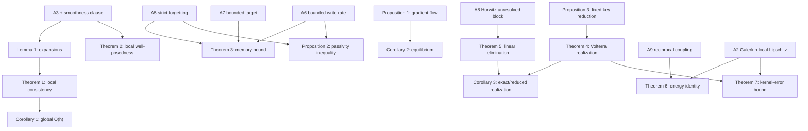

# CDM-GROM Theorem Dependency Map

## 1. Result inventory

| ID | Result | Assumptions/clauses used | Full proof |
|---|---|---|---|
| L1 | First-order expansions of \(D_n\) and \(\beta_n\) | bounded \(\Gamma_n,\eta_n\); C1 | Appendix A.1 |
| T1 | One-step consistency of the discrete recurrence | L1; A3; C1 | Appendix A.2 |
| C1 | Finite-time global error \(O(h)\) | T1; A3; C2 | Appendix A.3 |
| P1 | Regularized reconstruction gradient flow | fixed \(k,v,\Gamma,\eta>0\); symmetric \(\Gamma\) | Appendix A.4 |
| C2 | Unique equilibrium and exponential convergence | P1; \(\Gamma\succ0\) | Appendix A.5 |
| T2 | Local existence and uniqueness of CDM-GROM | A1–A3 | Appendix B.1 |
| T3 | Explicit memory-state bound | A5–A7 | Appendix B.2 |
| P2 | Dissipativity/passivity inequality | A5–A6 | Appendix B.3 |
| P3 | Fixed-key minimal realization | fixed \(k=q=e\), \(\Gamma=\gamma I\), \(\eta\ge0\) | Appendix C.1 |
| T4 | Auxiliary-state/Volterra equivalence | constant exponentially stable \(\Lambda_j\) | Appendix C.2 |
| T5 | Exact linear resolved–unresolved elimination | block linear system; A8 for decay | Appendix C.3 |
| C3 | Exact or reduced realization of the linear kernel | T4–T5; A8 | Appendix C.4 |
| T6 | Reciprocal-subclass energy identity and absorbing bound | A9; A2 and C4 for global absorbing bound | Appendix D.1 |
| T7 | Kernel-error propagation | A2; C3; integrable slip mismatch | Appendix D.2 |

The two entries denoted C1 and C2 in this table are **Corollary 1** and
**Corollary 2**, not the theorem-specific regularity clauses C1–C4 in
`NOTATION_AND_ASSUMPTIONS.md`.

## 2. Logical graph

## 3. Non-implications

The following arrows are intentionally absent:

- T3 does **not** imply global existence or global stability of the coupled
  CDM-GROM.
- T5 does **not** imply an exact memory formula for the full nonlinear
  Navier–Stokes equations.
- T6 does **not** imply that the reciprocal subclass captures unstable Hopf
  growth.
- C1 does **not** imply finite-step equivalence between the discrete recurrence
  and the continuous memory ODE.
- P3 shows that the matrix state is redundant for fixed addresses; it does not
  imply redundancy for state-dependent \(k(a)\) and \(q(a)\).

## 4. Verification-to-result traceability

| Script | Algebraic result exercised |
|---|---|
| `scripts/verify_continuous_limit.py` | L1 and T1 |
| `scripts/verify_gradient_flow.py` | P1 and C2 |
| `scripts/verify_memory_energy_identity.py` | T3, P2, and T6 |
| `scripts/verify_fixed_key_reduction.py` | P3 |
| `scripts/verify_linear_memory_kernel.py` | T4, T5, and C3 |
