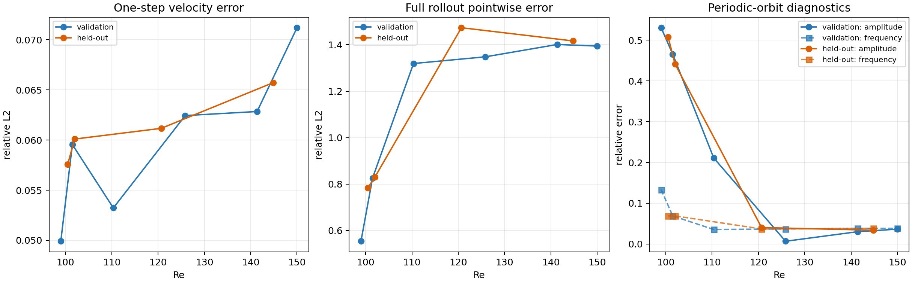

# 方柱绕流 POD–Galerkin 重新构建与验证报告

日期：2026-08-03

## 1. 结论先行

本次可以访问原始 OpenFOAM 构建数据，并已重新构建与原离散求解器一致的 POD–Galerkin 速度算子。旧模型误差很大的核心原因，不是“Galerkin 理论必然失效”，而是旧空间算子在 VTK 单元中心上用连续微分近似重建，没有复现 OpenFOAM 的有限体积离散、边界条件和 `linearUpwind` 对流格式。

Hopf 子集上的修正模型不再灾难性发散，但若保证全时域稳定，会明显压低起振后的振荡，仍不适合作为最终基线。按照预定回退方案，进一步在 periodic 子集上构建了冻结的 r28 速度 / r24 压力 FVM–Galerkin 模型。它在所有验证和 held-out 工况上均稳定积分至 `t=500`；held-out 平均单步速度相对误差为 **6.11%**。在充分周期的两个 held-out 工况 Re=120.6897 和 144.8276 上，极限环 RMS 振幅误差分别为 **4.04%** 和 **3.40%**，主频误差分别为 **3.70%** 和 **3.85%**。

因此建议把 **periodic r28/r24 模型作为当前正确且可用的 POD–Galerkin 基线**。它能较好再现高 Re 周期轨道的振幅和频率，但不能把长期逐时刻相位保持到 `t=500`；在临界点附近仍明显低估振幅。

## 2. 数据与原始算例核验

实际使用的正式 Re=100 OpenFOAM 源算例为：

```text
/home/ray/Desktop/centeredSquare/runs/cn09_graded_20260708_000142/Re100
```

原先容易误用的 `/home/ray/Desktop/centeredSquare/Re100` 是另一套旧算例，不能作为本数据集的离散算子来源。

核验到的主要离散设置包括：

- 对流项：`div(phi,U) Gauss linearUpwind grad(U)`；
- 扩散项：`laplacian ... linear corrected`；
- 法向梯度：`snGrad corrected`；
- 入口为抛物线速度，壁面和方柱为无滑移，速度出口为零梯度；
- 压力出口固定为零，其余压力边界为零梯度。

NPZ 快照与正确 OpenFOAM 算例在 Re=100、t=100 的速度最大绝对差约为 `5.96e-8`，确认原始快照和正式算例一致。

## 3. 修正后的 ROM 构造

### 3.1 离散一致的速度算子

编译了 OpenFOAM 13 工具 `romSpatialRhs`，直接在原网格和边界条件上计算

\[
R(U,p;\nu)=-\operatorname{div}(\phi,U)+\nu\operatorname{laplacian}(U)-\nabla p,
\qquad \phi=\operatorname{flux}(U).
\]

然后在 POD 模态及其有限差分探针状态上调用该工具，将投影结果装配为

\[
\dot a = c_c+A_c a+H_c(a,a)
+\nu(c_d+A_d a)+c_p+P b(a,\nu).
\]

速度质量矩阵与单位阵的最大偏差为 `2.12e-9`，扩散项沿模态轴的非线性残差为 `1.99e-8`，说明 POD 加权、探针装配和线性扩散分解在数值上自洽。

Re=100、t=100 上，张量化 ROM 右端与直接 OpenFOAM 投影右端的相对误差为 **7.63%**。剩余误差主要来自 `linearUpwind` 的分段/限制行为并不严格是全局二次多项式，因此不能被固定二次张量完全精确表示。

### 3.2 压力处理

压力 POD 使用与 OpenFOAM 相同的固定出口零压规范，不再逐快照减去空间均值。periodic 训练集的压力 POD 在 24 阶达到 99.9% 累积能量附近，最终保留 r24。

当前压力系数采用训练集拟合的线性参数闭合

\[
b(a,\nu)=W[1,\nu,a,\nu a],
\]

岭参数为 `0.01`。其 validation 真值输入平均压力系数误差为 **1.82%**，最大为 **3.43%**。

需要严格说明：这不是纯 Pressure–Poisson 求解器，也不是神经网络；它是“OpenFOAM 离散一致的侵入式速度 Galerkin 算子 + 低阶线性压力闭合”。因此最准确的称呼是 **校准型 FVM–POD–Galerkin ROM**。

## 4. Hopf 子集结果

Hopf 模型使用 r11 速度 / r11 压力。未经附加阻尼的线性压力模型可以稳定跑到 `t=500`，但 validation 全时域速度相对误差仍约为 `1.97`；低 Re 工况尤其差。

在仅使用训练/validation 数据选择线性涡黏阻尼

\[
-\gamma(a-a_c)
\]

后，最优 `gamma=0.3`，validation 汇总速度相对误差降至 **0.934**，所有工况均完成全时域积分。各 Re 误差为：

| Re | 速度全时域相对误差 |
|---:|---:|
| 94.5 | 0.662 |
| 95.25 | 0.667 |
| 95.5 | 0.674 |
| 97.5 | 0.895 |
| 99.0 | 0.968 |
| 101.5 | 0.948 |

这个结果虽然比旧模型和未阻尼模型明显改善，但物理上仍不理想：稳定化同时压低了高 Re 的 Hopf 振荡。因此没有把它冻结为最终模型，也没有使用 held-out 数据继续调它。

## 5. Periodic 模型验证结果

最终模型选择在读取 held-out 场之前完成冻结：

- 速度阶数 r28，压力阶数 r24；
- FVM 探针扰动 `eps=0.05`，共 1617 个探针状态；
- 线性压力闭合，ridge=`0.01`；
- RK4 最大内部步长 `0.05`，从两个快照间隔 warm-up 后开始自由滚动；
- 不使用额外涡黏阻尼；
- 张量 SHA-256：`d5e849b393a5b2649c19cb1431af738260a97bc593dd1f378647dd3659265b6b`。

### 5.1 Validation

6 个 validation 工况全部稳定到 `t=500`：

| Re | 单步速度误差 | 全滚动速度误差 | 振幅误差 | 主频误差 |
|---:|---:|---:|---:|---:|
| 99.0000 | 4.99% | 0.554 | 53.03% | 13.33% |
| 101.5000 | 5.96% | 0.826 | 46.54% | 6.90% |
| 110.3448 | 5.32% | 1.319 | 21.12% | 3.57% |
| 125.8621 | 6.24% | 1.348 | 0.69% | 3.70% |
| 141.3793 | 6.28% | 1.401 | 3.02% | 3.85% |
| 150.0000 | 7.12% | 1.394 | 3.65% | 3.85% |

validation 汇总：平均单步速度误差 **5.99%**；全滚动速度相对误差 **1.140**。高 Re 周期区的振幅和频率已经较准，但长期逐点误差因相位逐渐错开而超过 1。

### 5.2 冻结后的 Held-out 测试

4 个 held-out 工况此前未用于阶数、闭合或积分参数选择，均稳定到 `t=500`：

| Re | 单步速度误差 | 全滚动速度误差 | 振幅误差 | 主频误差 | 最终模态范数：预测 / 真值 |
|---:|---:|---:|---:|---:|---:|
| 100.5000 | 5.76% | 0.784 | 50.77% | 6.90% | 0.245 / 0.237 |
| 102.0000 | 6.01% | 0.830 | 44.13% | 6.90% | 0.254 / 0.245 |
| 120.6897 | 6.12% | 1.473 | 4.04% | 3.70% | 0.373 / 0.367 |
| 144.8276 | 6.57% | 1.416 | 3.40% | 3.85% | 0.517 / 0.496 |

held-out 汇总：

- 平均单步速度相对误差：**6.11%**；
- 全滚动速度相对误差：**1.126**；
- 全滚动压力相对误差：**0.898**；
- 平均振幅误差：**25.58%**，但该平均值由两个临界附近工况主导；
- 平均主频误差：**5.34%**；
- Re≥120.69 的两个充分周期工况，振幅误差均小于 4.1%，主频误差均小于 3.9%。



## 6. 指标如何解释

周期轨道只要频率有几个百分点偏差，经过数百个时间单位后，相位就会明显错开。因此 `t=0–500` 逐时刻 L2 可以大于 1，即使预测轨道的振幅、频率和最终能量包络仍然接近真值。这里不能只看全滚动逐点 L2，也不能只看频率；应同时报告：

1. 单步误差——检验局部动力学；
2. 是否全时域稳定——检验 ROM 数值/动力系统稳定性；
3. 极限环振幅和主频——检验周期吸引子；
4. 长期逐点误差——量化相位保持能力。

按照这四项，periodic 模型是一个可信的 POD–Galerkin 基线，但不是高精度长期逐时刻预测器。

## 7. 剩余问题与下一步

当前最主要的两个误差源为：

1. **临界附近振幅被低估。** Re≈100–102 的振幅低估 44%–51%，说明 r28 固定基和线性压力闭合没有精确恢复 Hopf 法向形增长率。
2. **长期相位漂移。** 高 Re 主频误差约 3.7%–3.9%，足以使 `t=500` 的逐点误差超过 1。

若下一步要求进一步提升，建议按以下顺序进行，而不是重新回到旧的连续微分张量：

1. 保留本次 OpenFOAM 离散 FVM 算子，针对 `linearUpwind` 增加非多项式/分区算子表示；
2. 使用 shift mode 或围绕各 Re 稳态基流构造参数化 POD，修正临界增长率；
3. 将压力改成真正的离散 Pressure–Poisson ROM，并显式处理速度边界 lifting；
4. 最后再考虑 CDM-GROM 记忆项，用于相位和截断模态闭合，而不是让记忆模型补偿错误的基础 Galerkin 算子。

## 8. 文件与远程位置

本地工作区：

```text
C:\Users\panxy1019\Documents\CHANNEL\centeredsquare_pod_galerkin_rebuild_20260803
```

远程主要结果：

```text
/home/ray/Desktop/centeredSquare/pod_galerkin_rebuild_v1
/home/ray/Desktop/centeredSquare/pod_galerkin_periodic_v1
/home/ray/Desktop/centeredSquare/pod_galerkin_rebuild_code
```

本地 `artifacts/periodic/frozen/FROZEN_METHOD.json` 记录了冻结参数和哈希；`artifacts/periodic/evaluation/heldout/` 保存最终测试指标；`code/` 保存 OpenFOAM 工具源码及 POD、探针装配、闭合、积分、冻结和分析脚本。
