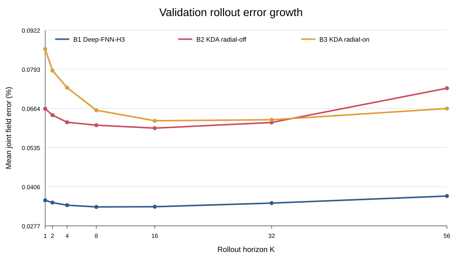
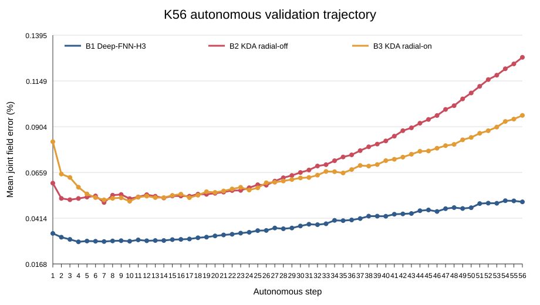
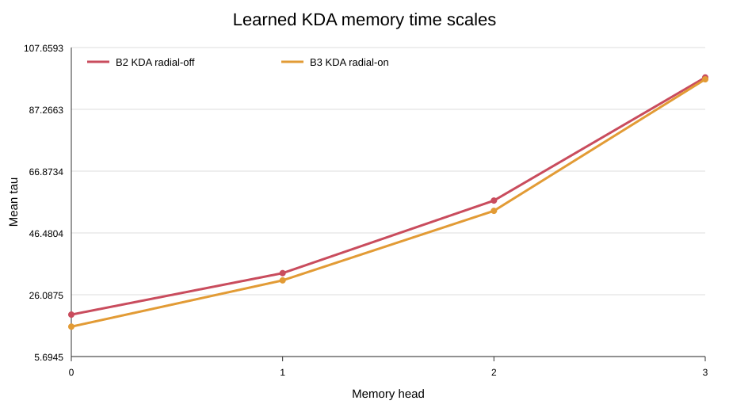
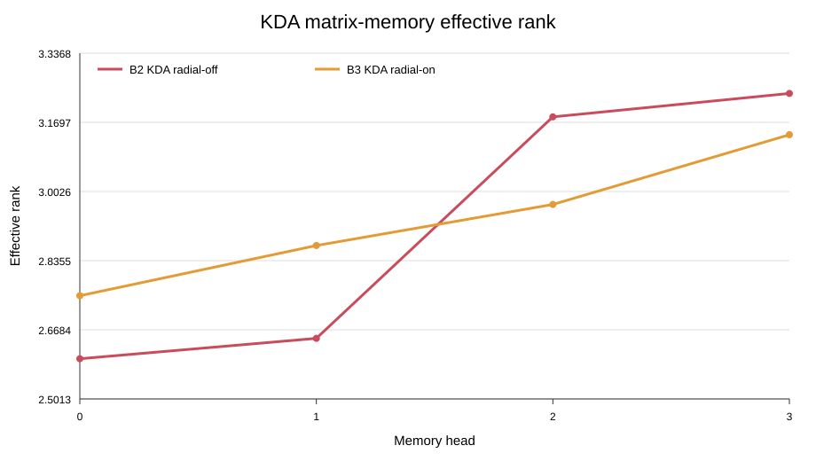

# CenteredSquare Hopf KDA-PR-FNN-ROM rollout 实验报告

## 1. 实验目的与结论摘要

本实验在已经冻结的 CenteredSquare Hopf r11 工程上，严格比较固定三状态深层 FNN 与 KDA 有限状态记忆闭合。评估仅使用六个 validation Reynolds 数；由于 B2 未达到预先冻结的 B1 对比门禁，held-out test 始终未加载。

三种模型在 K1–K56 的全部评估窗口上均保持 finite fraction=1、零发散。但是主方法 B2 在 K56 的平均联合场误差、终端误差和最坏窗口误差上均显著劣于 B1。B3 的 radial regularization 能改善 B2 的长期误差，但仍不足以超过 B1。因此当前证据不支持用 KDA 分支替换现有固定三状态 Hopf specialist，也没有证据支持继续加入 full attention。

## 2. 数据与冻结合同

- 数据：CenteredSquare CN09 graded mesh，Hopf specialist。
- POD：速度 `ru=11`，压力 `rp=11`，均仅由 23 个 train Re 拟合。
- Validation Re：94.5、95.25、95.5、97.5、99、101.5。
- Held-out Re：95.1、95.3、96.5、100.5、102；本轮硬禁用。
- 每个 Re 最多选取 64 个合法连续窗口；不得跨轨迹拼接。
- 评估 horizon：K1、K2、K4、K8、K16、K32、K56。

附件中的 560/192/176/67 维假设不适用于当前方柱 r11 工程。运行时实际合同为：当前块 46 维；每个历史块 66 维；两个历史块后 B1 输入为 178 维。冻结训练器中声明的 Hopf augmentation helper 并未进入正式前向，故 B2/B3 使用真实的 46 维 current-only 输入。

## 3. 方法详细描述

### 3.1 共同物理与数值合同

三组模型共享同一 train-only POD、Galerkin 算子、Pressure–Poisson 算子、归一化统计量、AdamW/余弦学习率、8000 optimizer-step 预算和K4→K8→K16→K32→K56 curriculum。方柱快照间隔下直接使用连续 Galerkin RK4 会失稳，因此遵循冻结工程：Galerkin RHS 作为当前物理特征，速度闭合学习有限差分导数；压力仍使用 Pressure–Poisson 基线、逐模态 sigmoid gate 和代数残差。

速度采用冻结 memory 的四阶段 RK 更新：

`a_(n+1) = a_n + dt/6 * (k1 + 2 k2 + 2 k3 + k4)`。

压力宏步闭合为：

`b_(n+1) = gate_n ⊙ P_H(a_(n+1), Re) + rho_p,n`。

### 3.2 B1：Deep-FNN-H3

B1 保留当前状态与两个历史状态构成的 178 维输入，删除全部 MoE router、shared/routed expert、Top-k、线性专家和低秩二次专家，改为六层宽度 512 的普通 FNN。三个输出头分别预测速度导数、压力残差和压力门控。参数量 1,745,797。

### 3.3 B2：KDA-PR-FNN-ROM radial-off

B2 删除显式历史拼接，只读取 46 维当前特征。Encoder 将当前特征映射到 128 维 token；四个 head 各维护一个 16×16 的 float32 动态矩阵，总动态状态为 1024。对于每个 head，遗忘、写入误差与更新为：

`alpha = exp(clamp(-dt/tau, -20, 0))`

`M_bar = Diag(alpha) M_prev`

`e = v - M_bar^T k`

`M = M_bar + beta k e^T`。

其中 `tau` 为逐 key-channel 正时间尺度，`beta∈[0,0.5]` 为逐 head 写入率。速度与压力使用不同 query 读取同一 memory。每条轨迹以三个真实初始状态按时间顺序warm-up；自主预测后只用预测状态更新 memory。memory 仅在宏步边界更新一次，四个 RK stage 内完全冻结，并在 AMP 下保持 float32。B2 不使用 radial loss。参数量 1,830,621，比 B1 增加 4.86%。

### 3.4 B3：KDA radial-on

B3 与 B2 完全相同，仅恢复 train-only 临界平面半径的对数幅值和增长正则。它用于判断 radial loss 是否能抑制 KDA 长时漂移，而不是主候选。

## 4. Rollout 指标

- `velocity_field_time_mean`：面积加权速度物理场相对 L2，在窗口与时间上平均。
- `pressure_field_time_mean`：去规范压力物理场相对 L2，在窗口与时间上平均。
- `joint_field_time_mean`：上述速度和压力误差之和。
- `joint_field_terminal`：每个窗口末端联合场误差的均值。
- `joint_field_worst_window_time`：所有窗口、所有时间中的最大联合场误差。
- `pressure_drift_time_mean`：压力 POD 能量相对漂移。
- 有限性门：finite fraction=1 且 divergent windows=0。

## 5. 聚合结果

| 模型 | K56速度均值 | K56压力均值 | K56联合均值 | K56终端 | 最坏窗口 | 压力漂移 | 推理时间* |
|---|---:|---:|---:|---:|---:|---:|---:|
| B1 Deep-FNN-H3 | 0.0205% | 0.0170% | 0.0376% | 0.0501% | 0.2376% | 0.5286% | 2.384s |
| B2 KDA radial-off | 0.0409% | 0.0322% | 0.0731% | 0.1276% | 0.6403% | 0.7733% | 3.394s |
| B3 KDA radial-on | 0.0358% | 0.0306% | 0.0664% | 0.0965% | 0.6303% | 0.9096% | 3.372s |

\* 推理时间是六个 validation Re 分批评估的合计 wall-clock，只用于同机相对比较。

B2 相对 B1：联合均值 +94.6%，终端 +154.6%，最坏窗口 +169.5%。

B3 相对 B2：联合均值 -9.2%，终端 -24.4%，最坏窗口 -1.6%。

## 6. K56 逐 Reynolds 数结果

| Re | B1联合均值 | B2联合均值 | B3联合均值 | B2/B1变化 | B3/B2变化 |
|---:|---:|---:|---:|---:|---:|
| 94.5 | 0.0250% | 0.0424% | 0.0664% | +69.3% | +56.7% |
| 95.25 | 0.0118% | 0.0186% | 0.0271% | +58.2% | +45.3% |
| 95.5 | 0.0155% | 0.0218% | 0.0276% | +40.9% | +26.2% |
| 97.5 | 0.0297% | 0.0589% | 0.0541% | +98.4% | -8.0% |
| 99 | 0.0538% | 0.0897% | 0.0832% | +66.8% | -7.3% |
| 101.5 | 0.0896% | 0.2072% | 0.1401% | +131.2% | -32.4% |

B2 在 Re=95.25 和 95.5 的中长 horizon 上表现相对接近 B1，但在 Re=97.5、99 和尤其 101.5 上明显恶化；Re=101.5 的 K56 联合时间均值达到 0.2072%，是同一 Re 下 B1 的 2.31 倍。这说明 KDA 的主要问题不是数值爆炸，而是随 Re 变化的闭合偏差。

## 7. KDA memory 诊断

| 指标 | B2 radial-off | B3 radial-on |
|---|---:|---:|
| 平均 tau | 51.927870 | 49.338269 |
| 平均 half-life | 35.993657 | 34.198682 |
| 平均 alpha | 0.895352 | 0.874073 |
| 平均 beta | 0.067848 | 0.073632 |
| memory Frobenius norm | 0.699986 | 1.074186 |
| 最大奇异值 | 0.697991 | 1.089852 |
| effective rank | 2.917212 | 2.933488 |
| delta write error | 2.005230 | 3.461623 |
| u/p query cosine | -0.151728 | -0.078650 |

两组 KDA 的 alpha 均约 0.87–0.90，并非接近 0，说明 memory 没有退化为纯短记忆；beta 约 0.068–0.074，也未接近 0，因此网络没有完全绕过写入。memory norm 和最大奇异值保持有限，没有爆炸。effective rank 约 2.9，高于 1，未发生严格 rank-1 collapse，但相对于 16 维 value 空间仍然较低，表明有效记忆子空间较窄。平均物理 half-life 约 34–36 个时间单位，确实形成了超过三状态窗口的长记忆，但该记忆并未转化为更好的 validation 泛化。

## 8. 计算成本

- B1：1,745,797 参数；训练 66.5 分钟；K56 六 Re 推理 2.384 秒。
- B2/B3：各 1,830,621 参数；训练约 94–97 分钟；K56 六 Re 推理约 3.38 秒。
- B2 相对 B1 的 K56 推理 wall-clock 增加约 +42.3%。
- KDA 额外动态状态为每条轨迹 1024 个 float32 数，不属于模型参数。

## 9. 预设门禁与科学判断

预设门禁要求 B2 相对 B1 至少在 mean joint、terminal 或 worst-window 中一项改善 10%，且速度或压力均值不得恶化超过 5%。B2 三项均恶化，因此明确失败。按照冻结协议，不生成 TEST_RESULTS.csv，不访问 held-out test，也不允许事后调整阈值。

对原始问题的逐项回答：

1. 删除 MoE、使用深层 FNN：B1 在本次 validation rollout 上稳定且非常准确，说明普通 FNN 是有效的轻量替代候选。
2. 相同 FNN 下 KDA 是否优于固定三状态历史：否，B2 明显更差。
3. KDA 是否改善长期速度误差：总体否；K56 速度均值高于 B1。
4. KDA 是否改善压力稳定性：否；压力场误差和压力漂移均高于 B1。
5. 是否只改善训练而未改善 validation：结果与此一致；最终训练 loss 很低，但 validation rollout 未获益。
6. 有效物理记忆时间：平均 half-life 约 34–36 个时间单位。
7. memory 是否 collapse/爆炸/被绕过：没有爆炸或完全绕过；effective rank 较低，存在显著低维化，但不是严格 rank-1 collapse。
8. 额外成本：参数增加 4.86%，K56 推理时间增加约 42%。
9. 是否值得替换当前 Hopf specialist：当前不值得。
10. 是否需要 full attention：当前没有必要。首先应解决 current-only 特征不足、memory 有效秩偏低和高 Re 闭合偏差；直接增加 attention 会混淆因果并显著增加成本。

## 10. 局限与后续建议

本报告是单 seed validation 结果，不是 held-out 泛化结论。由于主方法未通过预设门禁，继续多 seed 或 held-out 测试不符合当前协议。若开展下一轮，应作为新的预注册实验：优先检查 KDA token/value 归一化、提高 memory 有效秩、针对高 Re 采用稳定的时间尺度条件化，并保留 B1 作为强基线；不建议直接加入 Transformer/full attention。

## 11. 复现产物

- `ROLLOUT_RESULTS.csv`：逐模型、逐 Re、逐 horizon 的完整指标。
- `ERROR_GROWTH_CURVES.csv`：逐 rollout step 的速度/压力/联合场误差。
- `MEMORY_DIAGNOSTICS.csv`：逐模型、逐 Re、逐 head 的 KDA 诊断。
- `ROLLOUT_SUMMARY.json`：资产审计、检查点哈希和聚合结果。
- SVG 图：horizon 增长、K56 轨迹、memory 时间尺度与有效秩。
