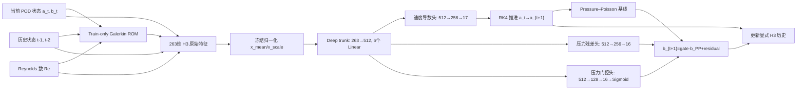

# Fluidic Pinball V2 Periodic B1：方法、网络架构与冻结融合指南

**模型标识：** `FluidicPinballV2_B1_Deep_FNN_H3_seed1248`  
**冻结检查点：** `best_validation.pt`，optimizer step 8000  
**检查点 SHA-256：** `c89a0cbf6cc0920664875f00234afaac49bc19b1c5c5f985cbba0b09e2dbdbda`  
**POD 维度：** `r_u=17`，`r_p=16`  
**原生时间契约：** `median_native_dt=1.0`  
**可训练参数：** 1,792,959  
**运行时隐状态：** 无神经网络隐状态；只有显式 H3 状态历史

## 1. 方法定位

B1 不是单独的 FNN 权重文件，而是以下组件组成的闭环 ROM 子系统：

1. train-only POD 坐标系与训练均值；
2. 速度 Galerkin ROM 和 Pressure–Poisson ROM；
3. 当前状态、Reynolds 数、物理量和两级历史组成的263维特征；
4. 固定训练归一化；
5. 共享深层 FNN trunk；
6. 速度导数、压力残差和压力门控三个输出头；
7. RK4 速度推进；
8. Pressure–Poisson 基线与神经残差联合得到下一步压力；
9. 显式更新 H3 历史，递归进入下一步。

因此，后续冻结与融合的正确对象应是“完整 B1 operator”，而不只是 `DeepFNNH3.model_state`。



## 2. 状态、坐标与时间契约

### 2.1 状态定义

- 速度系数：`a_t ∈ R^17`
- 压力系数：`b_t ∈ R^16`
- Reynolds 数：`Re ∈ R`
- H3 显式历史：当前状态加两个过去状态，即 `{t, t-1, t-2}`

这里的 H3 不是三个过去状态加当前状态。模型启动至少需要连续三个合法状态：`(a_t,b_t)`、`(a_{t-1},b_{t-1})`、`(a_{t-2},b_{t-2})`。

### 2.2 POD 坐标契约

速度和压力使用 periodic train-only 均值及 rank999 POD 基底。若上层融合模型中的其他子模型不使用完全相同的：

- POD 均值；
- 模态顺序与符号；
- `r_u=17, r_p=16` 截断；
- 压力 gauge；

则不能直接在系数空间混合。此时必须先映射到共同 POD 坐标，或重构到共同物理场空间再融合。

### 2.3 时间契约

模型训练的 `median_native_dt=1.0`。H3 历史差分和有限差分导数归一化没有显式 cadence 条件，因此当前冻结模型应作为 `Δt≈1.0` 子模型使用。

直接把 `Δt=0.25` 相邻状态送入 H3 会造成输入分布偏移。若未来融合系统需要原生 `Δt=0.25`，应采用以下一种方案后重新训练或校准：

1. 对历史差分除以各自 `Δt`；
2. 将 `Δt` 作为显式输入；
3. 使用多 cadence 训练；
4. 保持 B1 每1.0时间单位调用一次，由上层系统处理更细时间尺度。

## 3. Train-only 物理 ROM

### 3.1 Galerkin 速度特征

当前和历史状态均计算：

```text
g(a,b,Re) = c(Re) + A(Re)a + H:(a⊗a) + P b
```

张量形状：

| 张量 | 形状 | 说明 |
|---|---:|---|
| Re nodes | `[47]` | 47个训练 Reynolds 节点 |
| `c` | `[47,17]` | Re 相关常数项 |
| `A` | `[47,17,17]` | Re 相关线性项 |
| `H` | `[17,17,17]` | 二次速度项 |
| `P` | `[17,16]` | 压力到速度耦合 |

`c(Re)` 和 `A(Re)` 在相邻 train Re 节点间线性插值；`H`、`P` 共享。Galerkin 输出只作为网络输入特征，不直接作为速度导数基线相加。

### 3.2 Pressure–Poisson 基线

```text
b_PP(a,Re) = c_tilde(Re) + A_tilde(Re)a + H_tilde:(a⊗a)
```

| 张量 | 形状 |
|---|---:|
| `c_tilde` | `[47,16]` |
| `A_tilde` | `[47,16,17]` |
| `H_tilde` | `[16,17,17]` |

`c_tilde` 和 `A_tilde` 同样只在47个 train Re 节点之间插值。

## 4. 263维输入特征

### 4.1 当前状态基础特征：63维

下标为零基、左闭右闭。

| 索引 | 维度 | 特征 |
|---|---:|---|
| 0 | 1 | `(Re-110)/90` |
| 1 | 1 | `200/Re` |
| 2–18 | 17 | 当前速度系数 `a_t` |
| 19–34 | 16 | 当前压力系数 `b_t` |
| 35–51 | 17 | 当前 Galerkin 特征 `g_t` |
| 52 | 1 | `||a_t[0:4]||₂`，低阶速度能量幅值 |
| 53 | 1 | `||a_t[4:12]||₂`，中阶速度能量幅值 |
| 54 | 1 | `||a_t[12:17]||₂`，高阶速度能量幅值 |
| 55 | 1 | `||b_t||₂` |
| 56 | 1 | `||g_t||₂` |
| 57 | 1 | `||a_t||₂²` |
| 58 | 1 | `||b_t||₂²` |
| 59 | 1 | `||a_t||₂² + ||b_t||₂²` |
| 60 | 1 | `||a_low||₂² / (||a_t||₂²+eps)` |
| 61 | 1 | `||a_high||₂² / (||a_t||₂²+eps)` |
| 62 | 1 | `||b_t||₂ / (||a_t||₂+eps)` |

所以：

```text
CURRENT_DIM = 13 + 2*r_u + r_p = 13 + 34 + 16 = 63
```

### 4.2 两级历史扩展：每级100维

对 `lag=1` 和 `lag=2`，分别拼接：

```text
[a_{t-lag}, b_{t-lag}, g_{t-lag},
 a_t-a_{t-lag}, b_t-b_{t-lag}, g_t-g_{t-lag}]
```

单个 lag 的维度：

```text
17 + 16 + 17 + 17 + 16 + 17 = 100
```

精确索引：

| 索引 | 特征 |
|---|---|
| 63–79 | `a_{t-1}` |
| 80–95 | `b_{t-1}` |
| 96–112 | `g_{t-1}` |
| 113–129 | `a_t-a_{t-1}` |
| 130–145 | `b_t-b_{t-1}` |
| 146–162 | `g_t-g_{t-1}` |
| 163–179 | `a_{t-2}` |
| 180–195 | `b_{t-2}` |
| 196–212 | `g_{t-2}` |
| 213–229 | `a_t-a_{t-2}` |
| 230–245 | `b_t-b_{t-2}` |
| 246–262 | `g_t-g_{t-2}` |

最终：

```text
H3_DIM = 63 + 2×100 = 263
```

### 4.3 双重归一化

网络前执行固定训练统计归一化：

```text
x_std = (x_raw - x_mean) / x_scale
```

其中 `x_mean,x_scale ∈ R^263` 来自 train split。随后 trunk 的第一层还执行一个带可训练仿射参数的 `LayerNorm(263, eps=1e-5)`。这两层不能合并或删除：前者是数据契约，后者是网络参数。

## 5. 网络架构

### 5.1 共享 DeepTrunk

```text
Input [B,263]
  → LayerNorm(263)
  → Linear(263,512)
  → SiLU
  → 5 × [Linear(512,512) → LayerNorm(512) → SiLU]
  → latent h [B,512]
```

注意：第一个 `Linear(263,512)` 后没有额外 LayerNorm；输入前已有 `LayerNorm(263)`。后续五个512层各自在线性层后使用 LayerNorm。

| 模块 | 参数量 |
|---|---:|
| Trunk | 1,454,094 |
| Velocity head | 135,697 |
| Pressure residual head | 135,440 |
| Pressure gate head | 67,728 |
| **总计** | **1,792,959** |

FP32 权重约占6.84 MiB，不含框架和临时激活。

### 5.2 三个输出头

共享 latent `h∈R^512` 后分成：

```text
Velocity head:
512 → Linear(512,256) → SiLU → Linear(256,17)

Pressure residual head:
512 → Linear(512,256) → SiLU → Linear(256,16)

Pressure gate head:
512 → Linear(512,128) → SiLU → Linear(128,16) → Sigmoid
```

输出分别为：

- `v_std ∈ R^17`：标准化速度导数；
- `p_res ∈ R^16`：标准化压力残差；
- `gate ∈ (0,1)^16`：逐压力模态门控。

模型没有 Dropout、BatchNorm、attention 或神经网络 recurrent memory。所有 LayerNorm 只有当前样本依赖，不维护运行均值。

### 5.3 输出反归一化与物理含义

速度导数：

```text
f_theta = v_std ⊙ rhs_scale + rhs_mean
```

`rhs_mean,rhs_scale ∈ R^17` 来自 train split 的有限差分导数统计。

压力：

```text
b_{t+1} = gate ⊙ b_PP(a_{t+1},Re)
          + p_res ⊙ b_state_scale
```

压力残差没有额外加 `pressure_mean`。当前推理实际使用的是 `b_state_scale`；为保证检查点契约完整，部署包仍建议保留完整 `norm_stats`。

## 6. 单步闭环推进

给定当前状态和历史，B1 以 RK4 推进速度：

```text
k1 = f_theta(a_t, b_t, history, Re)
k2 = f_theta(a_t + 0.5*dt*k1, b_t, history, Re)
k3 = f_theta(a_t + 0.5*dt*k2, b_t, history, Re)
k4 = f_theta(a_t + dt*k3, b_t, history, Re)

a_{t+1} = a_t + dt/6 * (k1 + 2*k2 + 2*k3 + k4)
```

RK4 的四个 stage 都重新计算当前 trial velocity 的 Galerkin 特征，但：

- `b_t` 在四个 stage 内保持不变；
- H3 历史在四个 stage 内保持不变；
- 压力残差和门控只采用 k1 对应的网络输出；
- k2/k3/k4 计算出的压力头输出被丢弃。

完成 `a_{t+1}` 后计算压力，并更新显式历史：

```text
history_a ← [a_{t+1}, a_t, a_{t-1}]
history_b ← [b_{t+1}, b_t, b_{t-1}]
history_g ← [g_{t+1}, g_t, g_{t-1}]
```

一个完整时间步调用网络4次。按线性层估算，每次网络前向约1.78M MAC；单个 RK4 步约7.13M MAC，不计 ROM 张量计算和激活。

## 7. 训练目标与课程

### 7.1 训练 curriculum

| Optimizer step | Rollout horizon |
|---|---:|
| 0–1599 | K4 |
| 1600–3199 | K8 |
| 3200–5199 | K16 |
| 5200–6799 | K24 |
| 6800–7999 | K32 |

### 7.2 损失

基础项包括：

- `L_coeff`：按 `a_scale` 标准化的速度系数 MSE；
- `L_dyn`：按 `rhs_scale` 标准化的速度导数 MSE；
- `L_pressure`：按 `b_state_scale` 标准化的压力系数 MSE；
- `L_u_rel`、`L_p_rel`：模态相对损失；
- `L_energy`：速度系数能量的 Smooth-L1；
- `L_trajectory = L_u_rel + 0.25 L_p_rel`。

实际 B1 总损失：

```text
L = L_coeff + L_dyn + 0.55 L_pressure
    + 0.08 L_u_rel
    + (0.30 + 0.15 + 0.10) L_trajectory
    + 0.02 L_energy
```

B1 没有 KDA memory loss 和 radial loss。

## 8. 冻结边界

### 8.1 必须共同冻结的内容

| 类别 | 必需内容 |
|---|---|
| 神经网络 | `model_state`，严格加载到 `DeepFNNH3` |
| 输入统计 | `x_mean`, `x_scale` |
| 输出统计 | `rhs_mean`, `rhs_scale`, `b_state_scale` |
| 完整统计归档 | `pressure_mean/scale`, `a_scale`, relative floors |
| ROM | Galerkin `nodes,c,A,H,P` |
| Pressure ROM | `pc,pA,pH` |
| POD | train-only 均值、速度/压力基底、模态顺序、pressure gauge |
| 运行逻辑 | 263维拼接顺序、Re 特征常数、RK4、压力公式、H3 更新 |
| 时间契约 | `median_native_dt=1.0` |

### 8.2 最小部署包

建议从训练检查点派生一个只读 deployment bundle，至少包含：

```text
schema_version
model_state
norm_stats
median_native_dt
r_u / r_p / h3_feature_dim
POD basis + train means + pressure gauge metadata
Galerkin ROM tensors + Re nodes
Pressure–Poisson ROM tensors + Re nodes
feature_contract_version
checkpoint / asset SHA-256
supported_Re_range = [21.25, 60.0]
```

Optimizer、scheduler、GradScaler 和 validation history 对推理不是必需项。

### 8.3 两种冻结方式

离线推理或预计算专家输出：

```python
expert.eval()
expert.requires_grad_(False)
with torch.inference_mode():
    proposal = expert(...)
```

端到端训练融合器、且需要梯度穿过专家输入状态时：

```python
expert.eval()
expert.requires_grad_(False)
proposal = expert(...)  # 不使用 no_grad/inference_mode
```

第二种方式不会更新专家参数，但保留输出相对输入状态的梯度。若直接使用 `torch.no_grad()`，跨时间 BPTT 或上游状态网络可能收不到梯度。

## 9. 推荐的冻结子模型接口

不要只暴露 `model(x263)`。推荐封装完整 operator，并提供以下接口：

```text
encode_h3(state, history, Re) ->
    x_raw[263], x_std[263], galerkin_current[17]

closure_at(trial_a, frozen_step_context) ->
    rhs[17], pressure_residual[16], pressure_gate[16], latent[512]

pressure_candidate(a_next, k1_pressure_outputs, Re) ->
    b_next[16]

step(state, history, Re, dt=1.0) ->
    a_next[17], b_next[16], next_history, diagnostics
```

建议提供给上层融合器的 proposal：

```text
rhs                [B,17]
a_next             [B,17]
b_next             [B,16]
latent             [B,512]   # 可选，只读
pressure_gate       [B,16]    # 诊断
pressure_residual   [B,16]    # 诊断
native_dt           scalar=1.0
supported_Re_range  [21.25,60.0]
```

## 10. 融合策略

### 10.1 首选：在共同坐标中融合速度导数

若多个冻结子模型共享同一 POD 坐标，推荐在每个 RK stage 融合导数：

```text
f_fused(a) = Σ_i w_i(state,Re) f_i(a)
```

然后只用一次共同 RK4 得到 `a_{t+1}`。这样比“每个专家独立走一步后再平均状态”更一致，因为后者容易把不同相位的周期轨道平均成非物理解。

若路由权重依赖 trial state，理论上应在每个 RK stage 重算权重；若固定为时间步开始时的权重，必须在文档中明确这是近似。

### 10.2 压力融合

速度得到共同 `a_{t+1}` 后，让每个专家在该共同速度状态上产生完整压力候选：

```text
b_i = gate_i ⊙ b_PP_i(a_{t+1},Re) + residual_i
b_fused = Σ_i w_i b_i
```

优先混合完整 `b_i`，不要分别平均 `gate` 和残差后再重建压力，除非所有专家具有完全相同的 Pressure–Poisson 基线和残差尺度。

### 10.3 最稳妥的首版：冻结 B1 + 小残差校正器

若当前只有 B1 是可信基线，建议先采用：

```text
f = f_B1 + alpha(state,Re) * delta_f
b = b_B1 + beta(state,Re) * delta_b
```

把 `alpha/beta` 或校正器最后一层零初始化，使融合模型初始行为严格等于冻结 B1，再逐步学习修正。这比一开始让自由路由器覆盖 B1 更容易保持稳定。

### 10.4 可选：latent 融合

可以读取冻结 trunk 的 `h∈R^512` 供路由器或新融合头使用，但应把它视为只读表征：

- 不修改 B1 trunk；
- 不假设不同专家的 latent 可直接逐元素平均；
- 建议先对各专家 latent 做独立投影，再用于 router；
- 最终动力学仍通过共同坐标中的导数/状态输出约束。

### 10.5 不推荐的首版

- 直接平均不同 POD 基底下的系数；
- 独立 rollout 多步后再平均周期状态；
- 只冻结 FNN 权重而重新拟合输入归一化；
- 在 `Δt=0.25` 下直接调用当前 H3 模型；
- 用零历史或重复当前状态代替合法 H3 warm start；
- 在融合训练中无意解除 LayerNorm 或 ROM 参数冻结。

## 11. 融合验收测试

在训练融合器之前，冻结 wrapper 应通过以下测试：

1. **检查点严格加载：** `load_state_dict(strict=True)` 无缺失或多余键。
2. **参数冻结：** 1,792,959 个参数全部 `requires_grad=False`。
3. **单步等价：** wrapper 与原训练代码对同一 batch 的 `rhs/a_next/b_next/gate` 最大差异低于指定容差。
4. **多步等价：** K32 rollout 与正式 evaluator 的 CSV 指标一致。
5. **历史顺序：** 验证 `{t,t-1,t-2}` 更新无 off-by-one。
6. **时间保护：** 非 `dt≈1.0` 输入触发显式告警或拒绝，除非启用经验证的 cadence 适配器。
7. **POD 一致性：** 基底、均值、pressure gauge 和模态顺序哈希匹配。
8. **资产哈希：** checkpoint、coefficient view、Galerkin、pressure ROM 均匹配清单。
9. **融合初始等价：** 零初始化融合器时，系统输出严格等于 B1。
10. **梯度边界：** 专家参数梯度始终为空；需要时输入状态和 router 参数有梯度。

## 12. 当前冻结模型基准

修正 cadence 后的 final-test：

| 指标 | 结果 |
|---|---:|
| 全9 Re K32 joint | 0.841% |
| 全9 Re K32 terminal | 1.439% |
| 全9 Re K32 worst window | 4.506% |
| 7个 periodic-core Re K56 joint | 1.672% |
| K56 terminal | 3.078% |
| K56 worst window | 6.470% |
| Divergent windows | 0 |

后续融合模型至少应同时报告：

- 是否保持 B1 的数值稳定性；
- K1/K8/K16/K32/K56 的 U、p、joint、terminal、worst；
- 每个 Re 的误差；
- 相对冻结 B1 的增益；
- router 权重随 Re、相位和时间的变化；
- 是否在 Re=50.0 等困难节点改善，而不是只改善平均值。

## 13. 代码与资产位置

### 本地实现

- `C:/Users/panxy1019/Documents/Pinball/training/fluidic_pinball_periodic_v2_b1/code/train_b1_fluidic_pinball.py`
- `C:/Users/panxy1019/Documents/Pinball/training/fluidic_pinball_periodic_v2_b1/code/b1_data_contract.py`
- `C:/Users/panxy1019/Documents/Pinball/training/fluidic_pinball_periodic_v2_b1/code/evaluate_b1_validation.py`

### 集群实验

- 根目录：`/root/siton-data-ecd30b0dd03a4b6c86d4ad3b98458111/panxy/particalMOE/fluidic_pinball_periodic_v2_b1`
- 检查点：`runs/FluidicPinballV2_B1_Deep_FNN_H3_seed1248/best_validation.pt`
- 修正测试结果：`evaluation_final_test_corrected_dt1_all_offsets_k1_k32`
- K56 结果：`evaluation_final_test_corrected_dt1_all_offsets_k56_core`

### 关键资产哈希

| 资产 | SHA-256 |
|---|---|
| Frozen checkpoint | `c89a0cbf6cc0920664875f00234afaac49bc19b1c5c5f985cbba0b09e2dbdbda` |
| Coefficient view | `6766fd216bd5956e8dc3e7fe8d4d24b909e9b76e320a9257e814d93448d5482e` |
| Galerkin ROM | `c067c9c0eb26aee77ed1cf103e4d2be8a65c64f6f5a7249e02b5ebf1d68ab3dc` |
| Pressure ROM | `ac65f34aede9f3f8183eaf134319d5ad5e55b2a66032fe5fabccf4e4cf4c5d73` |

## 14. 推荐实施顺序

1. 从现有 checkpoint 和资产生成不可变 deployment bundle。
2. 实现 `FrozenB1Operator`，复用现有特征/ROM/RK4代码，不重写数学逻辑。
3. 完成单步、K32 和梯度边界等价测试。
4. 首先实现“冻结 B1 + 零初始化残差校正器”。
5. 再扩展到多专家 stage-wise derivative fusion。
6. 最后训练 router，并用与本报告一致的 cadence-aligned evaluator 比较。
