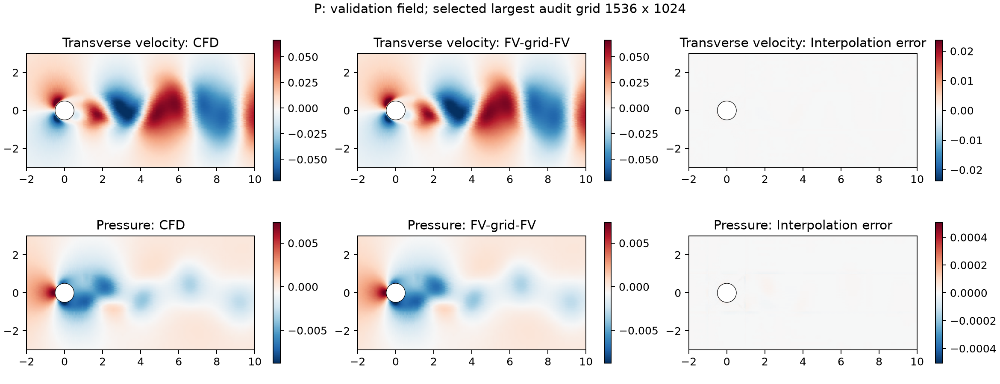

# POD–LSTM/GRU 与 FNO 实验：已完成结果与执行状态

日期：2026-09-23。本文件为RNN最终结果与FNO阶段性记录；**不能把FNO状态视为正式预测结果已经完成**。本轮没有修改论文、旧checkpoint或旧结果。

## 1. 当前状态

- POD–LSTM与POD–GRU：Hopf/Periodic各完成12候选筛选、正式三个种子、K24/K48测试、逐步/逐Re聚合和物理端到端计时，共12个正式模型。所有444个“模型/种子/窗口”的48步预测均有限完成，未触发10倍模态范数发散诊断。
- Hopf标准FNO：四个网格均未通过冻结插值门槛，按方案停止；没有训练/测试FNO，也没有伪填误差。
- Periodic FNO：1536×1024通过插值门槛和显存/可视检查。原始训练场恢复及正式训练管线另在`fno_P/`推进；当前不提供FNO精度值。训练资源探针不是正式训练结果。

## 2. POD–RNN结果（共同POD重构参考）

| 流态 | 模型 | K | Eu (%) | Ep (%) | 联合误差 (%) | 完成窗口 | 参数量 |
|---|---|---:|---:|---:|---:|---:|---:|
| H | POD–LSTM | 24 | 0.0168 ± 0.0060 | 0.0764 ± 0.0302 | 0.0932 ± 0.0361 | 126/126 | 108608 |
| H | POD–LSTM | 48 | 0.1235 ± 0.0772 | 0.5992 ± 0.3786 | 0.7227 ± 0.4557 | 126/126 | 108608 |
| H | POD–GRU | 24 | 0.0091 ± 0.0009 | 0.0403 ± 0.0053 | 0.0493 ± 0.0060 | 126/126 | 182592 |
| H | POD–GRU | 48 | 0.0322 ± 0.0252 | 0.1495 ± 0.1227 | 0.1817 ± 0.1479 | 126/126 | 182592 |
| P | POD–LSTM | 24 | 0.5259 ± 0.0512 | 2.3124 ± 0.1686 | 2.8383 ± 0.2197 | 96/96 | 108608 |
| P | POD–LSTM | 48 | 0.6879 ± 0.0712 | 2.8872 ± 0.2677 | 3.5750 ± 0.3389 | 96/96 | 108608 |
| P | POD–GRU | 24 | 0.5467 ± 0.0550 | 2.4169 ± 0.1755 | 2.9636 ± 0.2257 | 96/96 | 83520 |
| P | POD–GRU | 48 | 0.7619 ± 0.0855 | 3.1817 ± 0.3186 | 3.9436 ± 0.3933 | 96/96 | 83520 |

所有误差均为百分数。K24为同一次K48自主预测的前缀。先逐步平均、再Re内窗口平均、再Re等权平均、最后跨三个训练种子均值及样本标准差；联合误差先每种子Eu+Ep，再求SD。不把分量SD相加。

Periodic的K48结果低于**原版**Proposed的Eu=1.0107±0.6513%、Ep=3.9337±2.5070%；这必须如实呈现，不能写成物理混合结构普遍优于RNN。既有Dense的K48 Eu=0.4790±0.1208%、Ep=1.9208±0.5391%仍低于两种RNN。Hopf中的GRU优于LSTM，但三个种子的波动不能当成显著性检验或长时间稳定性证明。

## 3. 模型与固定预算

纯黑箱增量预测64维状态（32速度+32压力）。历史长3，每次推进重置RNN隐状态并编码当前三帧；没有跨窗口隐藏状态，没有Galerkin、PPE、专家路由或proposed压力头。输入另含训练专属标准化1/Re和已知输出时间间隔。最后线性头零初始化，初始模型为恒等增量；损失由标准化速度/压力系数MSE与训练波动能量归一化的物理误差二次型四项组成，权重均1。

采用相同预定义12组预算子集，并非宽度/层数/学习率等所有144种笛卡尔组合。每候选种子1248训练800步；H/P×LSTM/GRU共48个筛选运行。选型后正式种子1248、1600、2026均从头训练4000步，不搬用筛选checkpoint。batch64，AdamW，余弦学习率降至初始10%，global gradient clip1；curriculum按预算四等分为1/4/8/16，完全闭环、不使用teacher forcing。每200步以完整K48验证选checkpoint：先最小化最差Re联合误差，再宏平均联合误差。

选中结构：H-LSTM宽128/1层/dropout0/lr1e−3/wd1e−4；H-GRU宽128/2层/dropout0.1/lr1e−3/wd1e−4；P两种cell均宽128/1层/dropout0.1/lr1e−3/wd1e−5。单层时dropout应用于输出头前，不声称PyTorch单层recurrent dropout生效。所有参数都参与该稠密模型训练，非active-matched实验。

48个筛选运行全部有有限验证checkpoint；12个正式运行均完成预算并获接受。筛选累计训练程序计时411.9秒，正式训练累计489.5秒，均含相应验证调用、不含加载准备；并非严格独占GPU基准训练成本。

## 4. 数据和参考规范

Hopf沿用29训练Re/4092快照、2验证Re/225快照、3测试Re/483快照，42个测试窗口；Periodic为53训练Re/8539快照、6验证Re/967快照、4测试Re/644快照，32窗口。训练进程只读拆分的development文件，不读sealed_test文件。父基和均值均train-only，历史和预测不跨轨迹/split。Hopf扩展训练视图与原父系数/基逐项相同。

状态标准化沿用冻结checkpoint：H使用raw a/b特征x[2:66]的mean/scale；P使用alpha_next和pressure_state的mean/scale。RNN自身的1/Re和dt统计只用训练数据。两类基线使用相同`split_manifest.json`，FNO的可用原始场记录作为后续来源补充，不改写最初冻结清单。

压力预测与参考各自去面积均值；不增加误差分母epsilon，参考范数已检查非零。有限大误差保留；本次无非有限窗口。额外发散诊断为速度或压力模态范数超过各自真实窗口最大值10倍，只在完成自主预测后诊断，不影响推进或触发真值重置。

## 5. 端到端延迟和checkpoint

| 流态 | 模型 | seed | 选中step/4000 | 训练秒数 | K24延迟中位数 s | K48延迟中位数 s |
|---|---|---:|---:|---:|---:|---:|
| H | GRU | 1248 | 4000 | 45.39 | 0.052345 | 0.091005 |
| H | GRU | 1600 | 4000 | 45.48 | 0.053011 | 0.090322 |
| H | GRU | 2026 | 2800 | 45.57 | 0.046794 | 0.082619 |
| H | LSTM | 1248 | 2600 | 39.00 | 0.049631 | 0.091603 |
| H | LSTM | 1600 | 2800 | 39.01 | 0.052598 | 0.090804 |
| H | LSTM | 2026 | 3000 | 39.00 | 0.050488 | 0.093528 |
| P | GRU | 1248 | 3800 | 38.14 | 0.047598 | 0.083474 |
| P | GRU | 1600 | 3800 | 38.20 | 0.047680 | 0.083908 |
| P | GRU | 2026 | 3600 | 38.32 | 0.047678 | 0.083519 |
| P | LSTM | 1248 | 3600 | 40.38 | 0.048217 | 0.084075 |
| P | LSTM | 1600 | 4000 | 40.31 | 0.048141 | 0.083882 |
| P | LSTM | 2026 | 3600 | 40.68 | 0.047742 | 0.083584 |

RTX4090、Xeon8358P，CPU intra-op/BLAS为2线程。每seed同一流态首个冻结窗口，batch1，3次预热+10次重复；每次前后CUDA同步。FP32网络、FP64编码解码。输入为内存中共同POD重构物理三帧历史；含编码、标准化、CPU/GPU传输、自主推进、所有输出步的速度/压力物理解码和压力规范。加载、磁盘IO和误差计算排除。表列各seed重复时间中位数；原始每次时间/样本SD/IQR/显存峰值见每个`latency.json`。计时开始前已结束全部RNN训练与插值审计，没有并行FNO训练。

计时路径与缓存预测最大系数差2.645e-07，来自物理编码与浮点舍入。不是ROM/FOM加速比；不混用不同输出范围或历史FOM秒数。

## 6. FNO几何与插值可行性

全域x∈[−10,20]、y∈[−10,10]，圆柱半径0.5。FV点在2D挤出方向重合的坐标先做等权平均；FV→网格为Delaunay重心插值，网格→FV为剔除固体角点后重归一化的双线性插值，只有无有效模板时使用最近流体点。固体网格值零，误差采用原点面积权重、压力独立去均值。所有双向映射/网格及SHA保存在集群`fno_gate/*/maps/`。

每条**验证**轨迹均匀取17帧，H共2条、P共6条；没有使用测试场选网格。阈值在审计前冻结为既有完整三种子最佳模型K48误差的20%：H取Structured，P取Dense。该标尺来自既有POD参考结果，不是已完成原始CFD复评的基线误差；因此这是偏严格的工程门槛，不构成所有FNO不可行的普遍证明。

| 流态 | 网格 | 最差Re Eu (%) | 最差Re Ep (%) | Eu门槛 (%) | Ep门槛 (%) | 全部Re通过 |
|---|---|---:|---:|---:|---:|---|
| H | 192×128 | 0.509192 | 1.780408 | 0.001260 | 0.024189 | 否 |
| H | 384×256 | 0.189889 | 0.603042 | 0.001260 | 0.024189 | 否 |
| H | 768×512 | 0.076512 | 0.263067 | 0.001260 | 0.024189 | 否 |
| H | 1536×1024 | 0.042727 | 0.113793 | 0.001260 | 0.024189 | 否 |
| P | 192×128 | 0.732185 | 2.282483 | 0.095799 | 0.384164 | 否 |
| P | 384×256 | 0.307636 | 0.891898 | 0.095799 | 0.384164 | 否 |
| P | 768×512 | 0.146641 | 0.340865 | 0.095799 | 0.384164 | 否 |
| P | 1536×1024 | 0.069266 | 0.177147 | 0.095799 | 0.384164 | 是 |

Hopf在最大网格仍超限，停止标准FNO。Periodic只在最大网格全部验证Re通过。`roundtrip_visual_P.png`显示保留了主要尾迹结构；显存探针在宽32/modes12/4层、FP32、batch1、TBPTT1下峰值4,296,420,352字节（约4.00GiB），通过22GiB门槛。预热后训练单步约0.099秒、单步前向约0.039秒；实际多步闭环及完整验证还要乘以步数/窗口数，不能用单步时间冒充完整训练耗时。

## 7. FNO实现与后续执行边界

已实现四层2D Fourier算子（正/负频率权重）、逐点线性分支、lifting/projection、三帧历史、坐标/mask/1/Re/dt、direct或increment输出、固体掩码。通过低频恒等映射、有限反向梯度、输出尺寸与固体零值单元测试。它是依据[FNO原论文](https://arxiv.org/abs/2010.08895)的独立实现，不是作者官方checkpoint复现；[ICLR2025记忆建模论文](https://proceedings.iclr.cc/paper_files/paper/2025/hash/89379d5fc6eb34ff98488202fb52b9d0-Abstract-Conference.html)只作动机，不把本RNN/FNO称为MemNO。

Periodic正式方案另存`fno_P/protocol_frozen.json`：6个预定义候选×400优化步筛选，三正式种子各4000优化步；每优化步包含1/4/8/16帧闭环窗口，TBPTT1但窗口内累积梯度后统一更新；fullK48验证使用共同FV原始场误差选型。只读取真实CFD训练场，不以POD重构替代FNO训练数据。还需完成原始训练场传输、筛选、三种子正式训练及测试/计时，未完成前不提供FNO对比行。

## 8. 资源修复、可复核性和文件

集群两个Hopf验证NPZ副本约8.5MB，zip读取失败；未覆盖。Re46.7完整32.5MB版本从原模拟VM `HopfExpansion_20260721/worker_1/`恢复，Re56.543246从公开数据集恢复。新副本放在独立raw_validation目录；其完整性与点序在插值审计中校验。最初manifest的旧路径/hash仍保留，不能把其存在等价为原始场完整。

旧Proposed checkpoint实际复跑相对缓存差<1e−6；两流态旧误差复算通过舍入容差。独立交付检查从21,312条逐步误差重建全部8行三种子汇总，最大差4.441e-16。RNN的checkpoint、配置、完整训练记录、逐窗口/逐Re误差、预测NPZ、hash和计时均在`results/formal/`；筛选记录在`results/screen/`。`POD_RNN_table_rows.tex`为自动生成LaTeX行，未修改论文。

结论只针对当前H/P表示、预算与窗口；不能由此推出E2/T2-C收益、跨几何优势或任意长时间稳定性。FNO阶段未闭合不应伪报“两个实验全部完成”。
